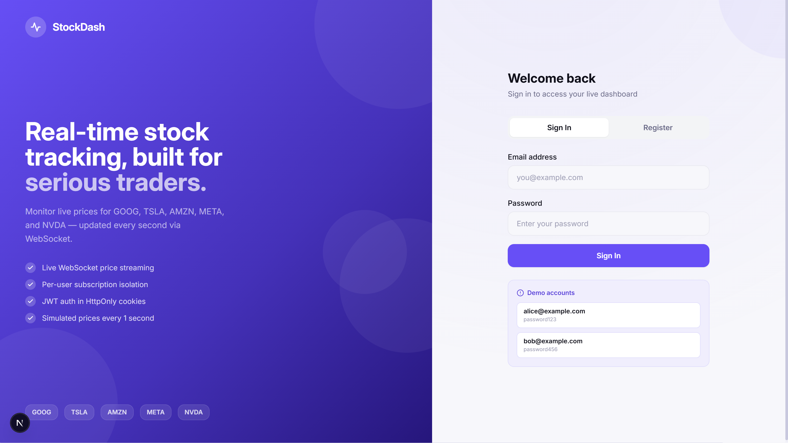
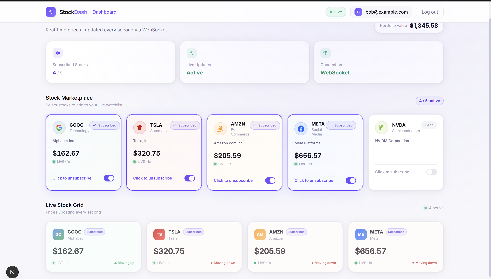
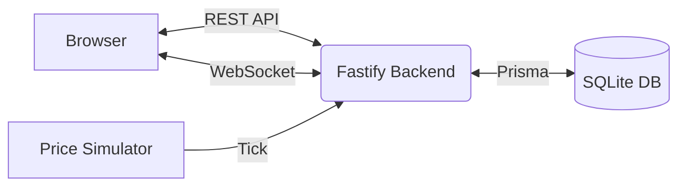
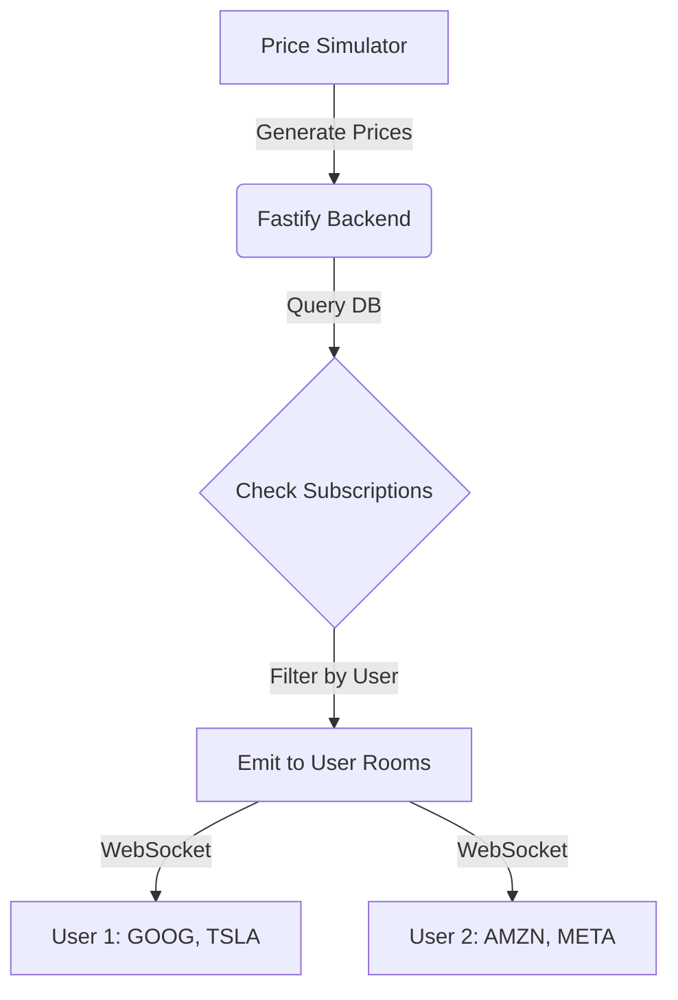

# Stock Broker Client Web Dashboard

This project is a web dashboard that allows users to log in, subscribe to a list of predefined stocks, and view live price updates. It was built to satisfy the requirements of the stock broker assignment.

## Screenshots

### Login Page


### Dashboard


## Assignment Requirements Covered

- [x] Login using email
- [x] Subscribe using stock ticker
- [x] Support only:
  - GOOG
  - TSLA
  - AMZN
  - META
  - NVDA
- [x] Update prices without refresh
- [x] Multiple users receive independent updates
- [x] Simulated stock prices

## Features

- Email and password login
- View a list of 5 supported stocks and click to subscribe or unsubscribe
- Dashboard displaying only the stocks the user is currently subscribed to
- Realtime price updates every second using WebSockets
- User-specific data isolation

## Tech Stack

- **Frontend:** Next.js, React, Tailwind CSS
- **Backend:** Fastify, Socket.IO, Prisma
- **Database:** SQLite

## How It Works

1. **Login:** The user logs in via a REST API and receives an authentication token in a cookie.
2. **Subscribe:** The user selects which stocks they want to track from the list of 5 supported tickers. This preference is saved in the database.
3. **WebSockets:** Once logged in, the dashboard opens a Socket.IO connection to the backend.
4. **Price Updates:** A background loop on the server generates random prices every second. It checks which users are subscribed to which stocks, and pushes the new prices directly to those specific users over the active socket connection.

## Architecture

### System Architecture



### Realtime Update Flow



## Folder Structure

```text
├── backend/
│   ├── prisma/      # SQLite database and schema
│   └── src/         # API routes, websockets, and price simulator
└── frontend/
    ├── app/         # Next.js pages (login, dashboard)
    └── components/  # React components for the UI
```

## Setup

You will need Node.js installed.

1. Clone the repository.
2. Install dependencies for both parts:

```bash
cd backend
npm install

cd ../frontend
npm install
```

## Environment Variables

**Backend (`backend/.env`)**
```env
DATABASE_URL="file:./dev.db"
JWT_SECRET="your_jwt_secret"
FRONTEND_URL="http://localhost:3000"
BACKEND_PORT="4000"
```

**Frontend (`frontend/.env`)**
```env
NEXT_PUBLIC_API_URL="http://localhost:4000"
```

## Running Locally

**Backend**
```bash
cd backend
npm run db:reset
npm run dev
```

**Frontend**
```bash
cd frontend
npm run dev
```
The project will be running at `http://localhost:3000`.

## Testing

To verify the multi-user and realtime requirements:

1. Open `http://localhost:3000` in a normal browser window and log in.
2. Open a second session in an incognito/private window and log in with a different test user account.
3. In the first window, subscribe to GOOG and TSLA.
4. In the second window, subscribe to AMZN and META.
5. Verify that each dashboard updates its prices every second without refreshing the page.
6. Verify that the first window only receives prices for GOOG and TSLA, while the second window receives prices independently for AMZN and META.

## Security Notes

- Passwords are hashed in the database using bcrypt.
- Sessions are managed with JWTs stored in HttpOnly cookies to prevent client-side script access.
- Incoming API requests are checked with request validation using Zod.

## Future Improvements

- Add real market data integration instead of simulated prices.
- Allow users to reset their passwords.
- Implement pagination for historical portfolio tracking.

## Notes

The prices shown on the dashboard are simulated using a random number generator on the server and do not reflect real market data.
