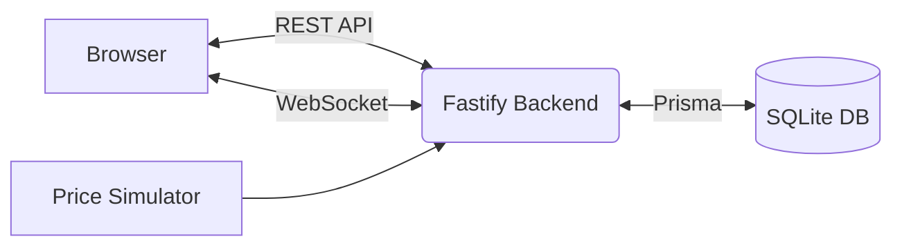
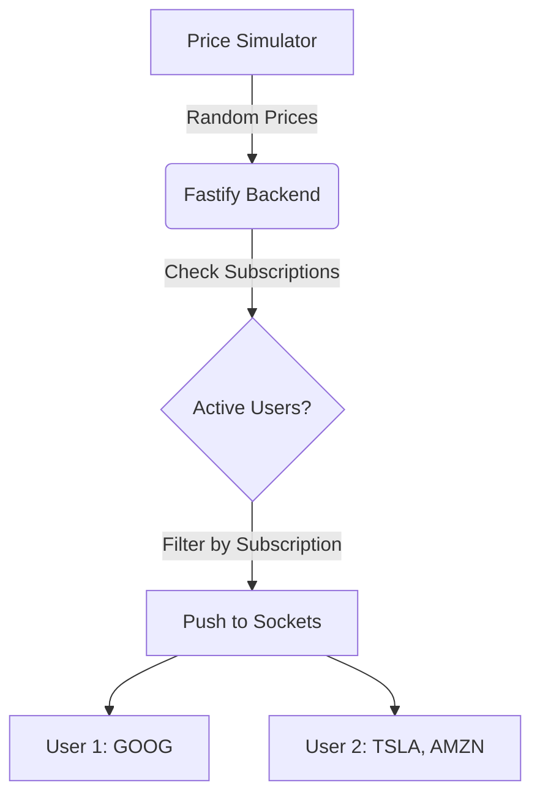

# Stock Broker Client Web Dashboard

This project is a real-time stock broker dashboard. It provides a web interface where users can track a specific set of simulated stocks and receive live price updates.

## Screenshots

### Dashboard

*Main dashboard showing active subscriptions and live prices.*

### Login

*Email authentication screen to access the project.*

## Assignment Requirements Covered
- Login using email
- Subscribe using ticker code
- Supported stocks: GOOG, TSLA, AMZN, META, NVDA
- Stock updates every second
- No refresh required
- Multiple users receive independent asynchronous updates
- Prices are simulated

## Features
- Email login
- Select and subscribe to predefined stocks
- Personalized dashboard with only subscribed stocks
- Live price updates via WebSockets
- Independent data delivery for concurrent users

## Tech Stack
- **Frontend:** Next.js, React, Tailwind CSS
- **Backend:** Fastify, Socket.IO, Prisma
- **Database:** SQLite

## System Overview
Users log into the project via a REST API and receive a secure token. Once authenticated, they subscribe to their preferred stock tickers, which are saved to the database. The frontend establishes a WebSocket connection to the server. A background simulator continuously generates random prices every second. The server filters these prices based on active user subscriptions and pushes the updates independently to each connected client. This ensures users only see real-time data for the specific stocks they chose, without refreshing the page.

## Architecture

### System Architecture


### Realtime Flow


## Folder Structure
```text
├── backend/
│   ├── prisma/      # Database schema
│   └── src/         # API and websocket logic
└── frontend/
    ├── app/         # Next.js routes
    └── components/  # React UI
```

## Local Setup
Ensure Node.js is installed.

```bash
cd backend
npm install

cd ../frontend
npm install
```

## Environment Variables

**Backend (`backend/.env`)**
```env
DATABASE_URL="file:./dev.db"
JWT_SECRET="secret_key"
FRONTEND_URL="http://localhost:3000"
BACKEND_PORT="4000"
```

**Frontend (`frontend/.env`)**
```env
NEXT_PUBLIC_API_URL="http://localhost:4000"
```

## Running

**Backend**
```bash
cd backend
npm run db:reset
npm run dev
```

**Frontend**
```bash
cd frontend
npm run dev
```

## Testing
1. Open `http://localhost:3000` in a normal browser window and log in.
2. Open a new incognito window and log in with a different account.
3. Subscribe to GOOG and TSLA in the first window.
4. Subscribe to AMZN and META in the second window.
5. Observe the prices update every second in both windows independently.

## Security Notes
- Passwords hashed using bcrypt
- Sessions managed via JWT
- Tokens stored in HttpOnly cookies
- Input checked with request validation

## Future Improvements
- Replace simulated prices with real market data.
- Add password reset functionality.
- Show historical portfolio graphs.

## Notes
The prices shown on the dashboard are simulated and do not reflect real market data.
